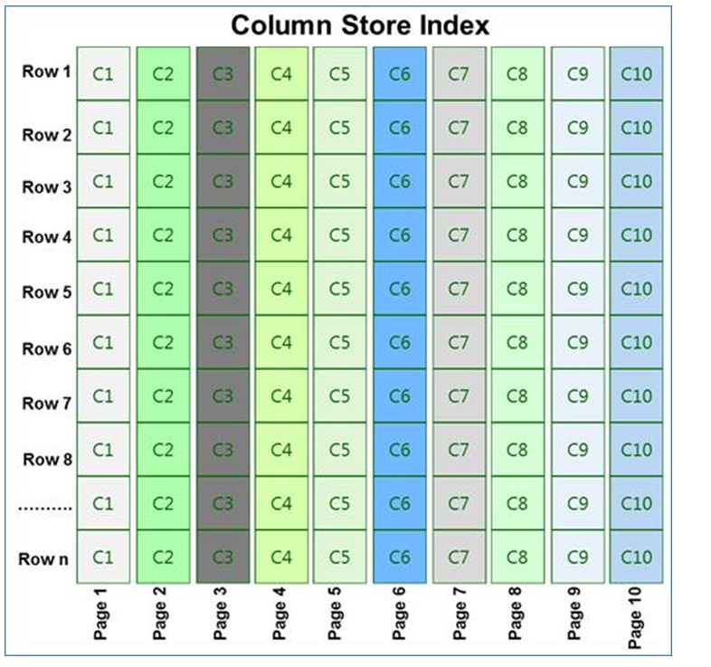
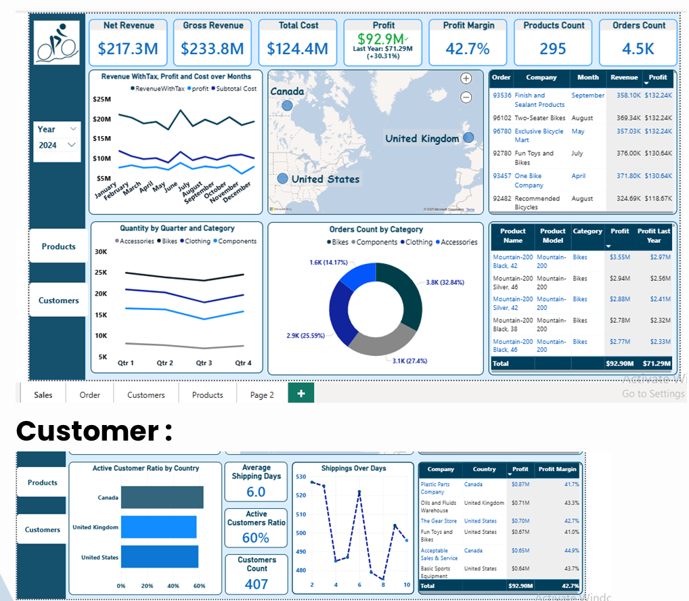
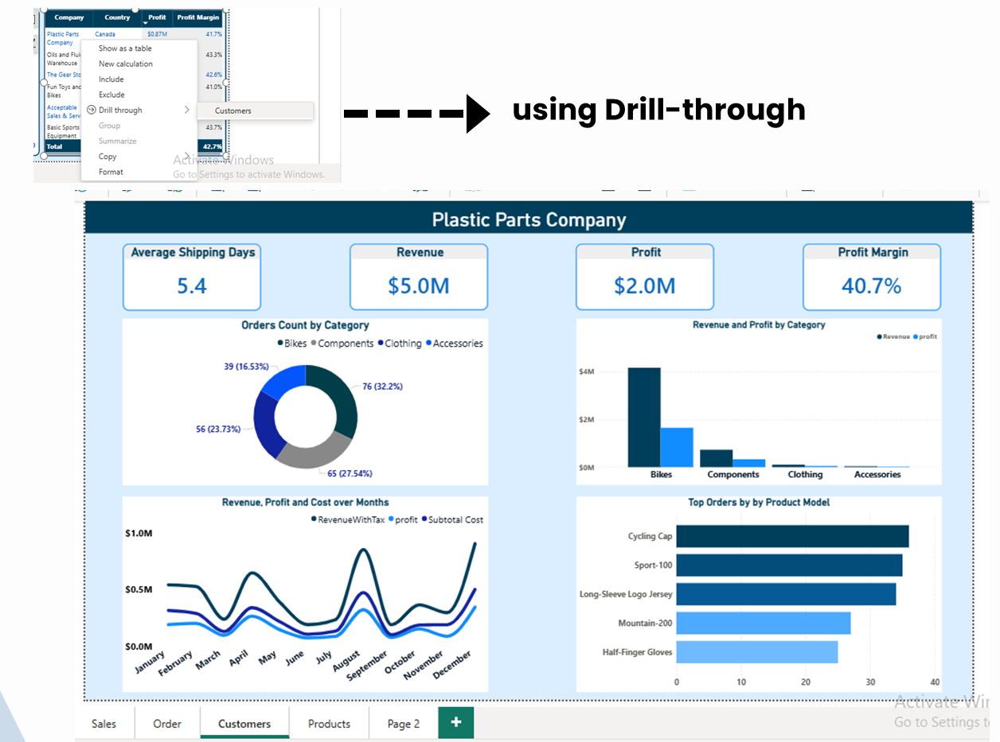
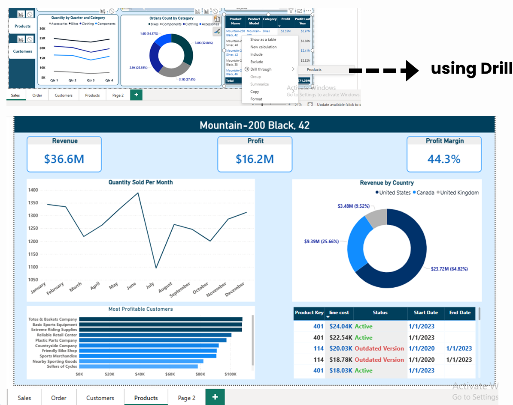
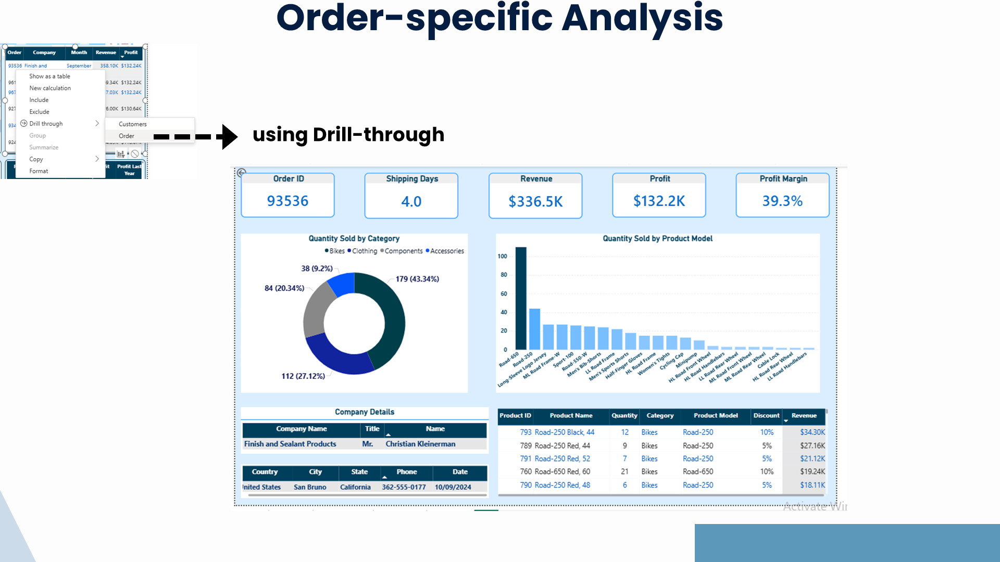

# End-to-End Data Warehouse & BI Solution | Ejada Internship

## 📌 Project Overview
This project was developed during my internship with **Ejada**. It demonstrates an **end-to-end data solution** that combines both **Data Engineering** and **Business Intelligence** to transform raw transactional data (Adventure Works) into decision-ready insights.

The project was delivered in **two phases**:
1. **Phase 1 – Data Engineering:** Building a complete data warehouse pipeline using **SSIS + SQL Server**.
2. **Phase 2 – Business Intelligence:** Creating an interactive **Power BI dashboard** for business analysis.

---

## 🛠️ Tech Stack
* **Database & OLAP:** SQL Server, Data Warehouse, Star Schema Modeling
* **ETL Tool:** SQL Server Integration Services (SSIS)
* **BI Tool:** Power BI
* **Performance & Tracking:** Clustered Columnstore Indexes, SCD Types 0, 1, 2

---

## 🏗️ Phase 1: Data Engineering (ETL & DW)
In this phase, I built a scalable, dynamic, and reusable pipeline to move data from a staging area to a production-ready Data Warehouse, handling initial and incremental loads.

### ⚙️ ETL Architecture & Execution
I designed a multi-stage ETL process including Initialization (Constraints handling), Staging, and Dimension/Fact loading, aligned with enterprise-grade practices.

### ⚡ Performance Optimization & Outcomes
* 🚀 Achieved a **2.5x performance improvement** by shifting analytics from OLTP to OLAP and optimizing fact tables using **Clustered Columnstore Indexes**.
* 🗂️ Implemented **Slowly Changing Dimensions (Types 0, 1, 2)** for reliable historical tracking.
* 🎯 Strengthened expertise in data warehousing, metadata tracking, and ETL workflows.

  

---

## 📊 Phase 2: Business Intelligence (Power BI)
I developed an interactive sales performance dashboard suite providing deep-drill capabilities for Sales, Products, and Customers, utilizing regional maps and time filters (2020–2024).

### 📈 Executive Sales Overview & Strategic Insights
* **Profitability:** Strong **42.7% profit margin** with $233.8M revenue and $92.9M profit.
* **Growth:** **+30.3% YoY profit growth**, mainly driven by bike sales.
* **Seasonality:** Identified seasonal revenue peaks in **January & June**.

### 🔍 Drill-Through Analysis (Customers & Products)
Enabled drill-through navigation from Sales → Orders → Customers → Products.
* **Customer Deep-Dive:** Identified the most profitable customer (Plastic Parts Company, Canada) and a **customer concentration risk**. Found **40% inactive customers**, showing a massive reactivation opportunity.
* **Shipping Efficiency:** Tracked a **6-day average shipping time** (competitive, but room for optimization for high-value customers).

  
  

### 📦 Order-Specific Analysis
Detailed view of individual orders including line costs, status tracking, and quantity by product model.

---

## 📂 Repository Contents
* `SSIS/` → Integration Services packages (ETL workflows).
* `SQL_Scripts/` → SQL queries, stored procedures, transformations.
* `PowerBI/` → `.pbix` dashboard file.
* `docs/` → Project presentation slides (`EJADA Presentation.pdf`) and dashboard screenshots.
* `Social/` → Links to project demonstrations and LinkedIn posts.

---

## 🚀 Future Work
* Migrate data warehouse pipeline to **Azure Data Factory** for cloud scalability.
* Automate Power BI refresh using **Power BI Service + Gateway**.
* Extend analysis with **predictive modeling** (ML on sales trends & churn).
* Improve dashboard storytelling with **advanced DAX measures**.

---
MIT License | Developed by **Ahmed Samy** (Ejada Internship 2025)
